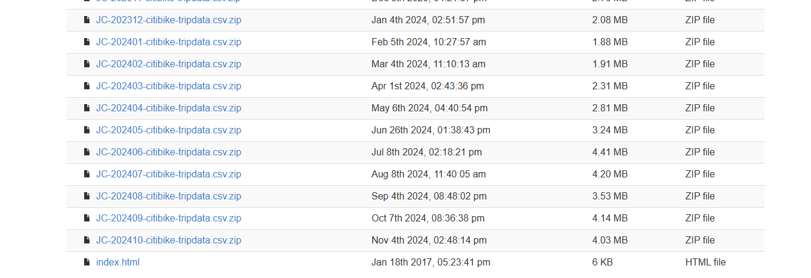
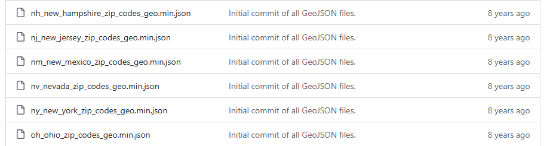
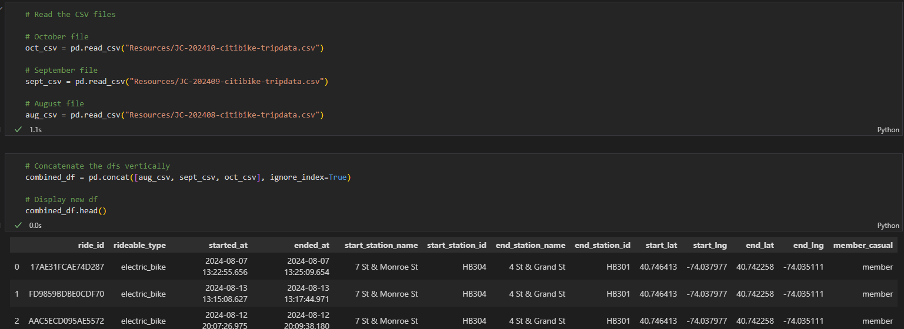
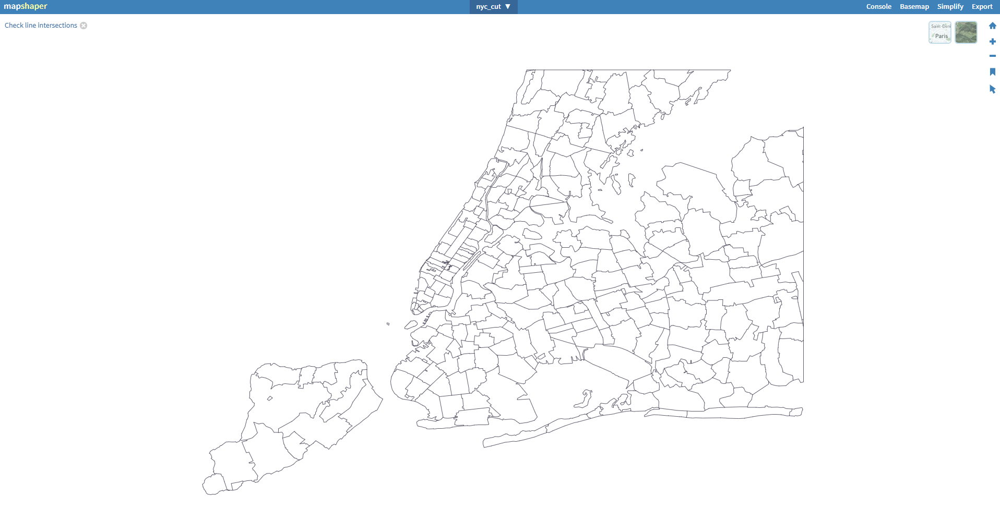
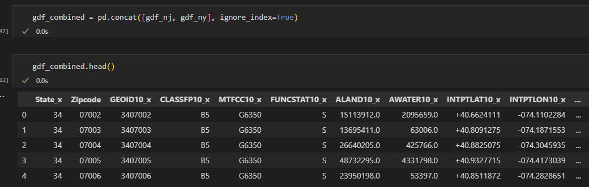
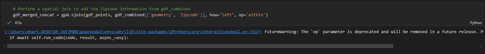
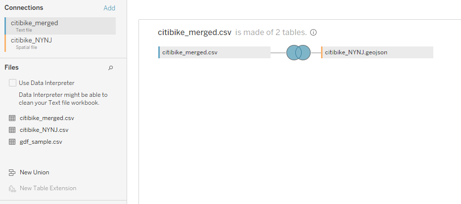
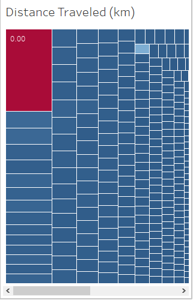
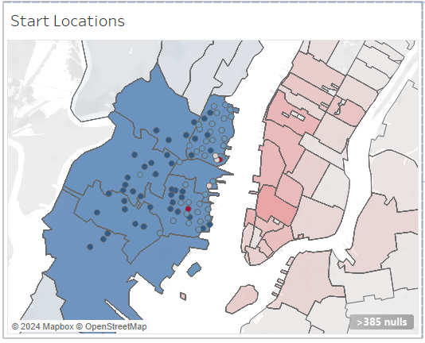

# README for Module 18 Challenge (citi-bike-tableau)

## Introduction

This challenge is to create a Tableau story, complete with dashboards, visualizations, and analysis. The challenge is to use Citibike data to look for interesting phenomena and create an interactive and easy to follow presentation for everyone to follow. The analysis looks at when, for how long, and where rides are happening. Interesting phenomena of zero distance rides being most common, and extremely low New York City representation in the data, are examined.

## Data

The data consists of many different files accumulated together. In its raw form this data consists of 3 CSV and 2 GeoJSON files. The CSV files are taken from an `s3` bucket of Citibike trip data (see References). The latest three files were selected to try and make the report the most relavent. The following shows the bottom of the page.

[JC-202410-citibike-tripdata.csv.zip](https://s3.amazonaws.com/tripdata/JC-202410-citibike-tripdata.csv.zip), [JC-202409-citibike-tripdata.csv.zip](https://s3.amazonaws.com/tripdata/JC-202409-citibike-tripdata.csv.zip), and [JC-202408-citibike-tripdata.csv.zip](https://s3.amazonaws.com/tripdata/JC-202408-citibike-tripdata.csv.zip) were selected and downloaded.

Also present in the dataset is edited GeoJSON data for New York and New Jersey from OpenDataDE (see References). [nj_new_jersey_zip_codes_geo.min.json](https://github.com/OpenDataDE/State-zip-code-GeoJSON/blob/master/nj_new_jersey_zip_codes_geo.min.json "nj_new_jersey_zip_codes_geo.min.json") and [ny_new_york_zip_codes_geo.min.json](https://github.com/OpenDataDE/State-zip-code-GeoJSON/blob/master/ny_new_york_zip_codes_geo.min.json "ny_new_york_zip_codes_geo.min.json") were downloaded.

## Methodology

To create this Tableau presentation, first the data needed to be preprocessed. The first thing to do was load the CSV files into a pandas DataFrame and then create a union to stack them all on top of each other.  The following is a screenshot of some of that process (taken from `main.ipynb`):

Once the CSV were concatenated into one pandas DataFrame, it could be exported back as a CSV for now. Next the GeoJSON files needed to be preprocessed. There was a lot of trial and error at this part. First direct joins of the GeoJSON files in Tableau were attempted. Eventually it was decided to cut back on the large scale of those files. Both GeoJSON files contain polygons for every zipcode boundary in New Jersey and New York states.

Using mapshaper (see References) the GeoJSON files were cut down to only have the essential zip code information for this analysis. The following is an example:

Next, through trial and error again, it was decided to concatenate the two trimmed GeoJSON files together. Many attempts at joining the three files (1 combined CSV and 2 separate GeoJSON files) gave varying results. To concatenate the files was very similar to the process earlier:

Load the GeoJSON files into pandas DataFrames, then concatenate those DataFrames. Finally a join of these two combined files was required:

This was done to incorporate zipcode information (one of the requirements of the challenge) into the eventual Tableau presentation. It took an inordinate amount of time and it is likely that there was any easier way to get the same results. Finally one single CSV was created and the Zipcode information worked well for the Tooltip. However the `'geometry'` column was not working properly in Tableau. A desperate attempt to get the Zipcode boundary polygons into this dataset resulted in success. The combined GeoJSON file was joined to the fully merged CSV file in Tableau using a full outer join. This enabled to presentation to continue after many hours:

Next the work of the actual Tableau presentation which involved examining the data and creating test visuals. First creating a map, then looking at ride distance and duration. Then examining the most popular areas for Citibike rides. This examination led to seeing interesting phenomena, namely a massive weight towards Jersey City and a strange 0 distance prevalence among rides.

## Results

The Tableau presentation was instrumental in examining trends and interesting phenomena. The preprocessing was time consuming but, once complete Tableau offers a quick and intuitive way to plot data. 

The first interesting phenomena was discovering that the most common distance for rides was 0km. The calculated field for distance looked at the the distance between the start location and end location. However, if you were to return the bike to the same place you got it, it would register 0km no matter how far you pedalled. This phenomena was confirmed by looking at the most popular state, zipcodes, and stations for rides in the dataset.

The second interesting phenomena was solved in writing this README. While revisiting the file names and location, it was observed that all the CSV files downloaded from Citibike started with the letters JC (e.g. [JC-202410-citibike-tripdata.csv.zip](https://s3.amazonaws.com/tripdata/JC-202410-citibike-tripdata.csv.zip)). This likely refers to Jersey City data and explains perfectly why New York City was so under represented in the dataset. It is an oversight by this analysis that the result took this long to recognize.  Further investigation of the data on the `s3` bucket site would likely have unearther this problem earlier in the analysis.

The Tableau workbook is then published to Tableau Public, and a copy of the workbook is saved to this repo.

## Conclusion

Tableau is a powerful tool for creating visuals, dashboards, stories, and analysis. The Citibike data was easily (once preprocessed) used to create insightful visual analysis. Recommendations for Citibike could be to use GPS trackers on their bikes to measure the distance of rides. This could help assess maintenance and safety related issues with the bikes themselves. Also they might consider combining all their data into a single file instead of dividing it between Jersey City and New York. 

Careful consideration is imperative in the initial stages of analysis. Basically be careful to see what data you are using. During this analysis a file that was likely labeled to show it was from New Jersey was overlooked. It was presumed that the data from Citibike was for the entire Citibike data when in fact it had been divided. Spending more time analyzing many samples of data from the `s3` bucket would have helped start the analysis on better footing. This oversight was a limitation that led to hours of confusion and testing.

Citibike has a lot of traffic in New Jersey. In the last three months on record (Aug, Sept, Oct) there have been over 340,000 rides. Each month had over 100,000 rides. It seems a lot of the traffic comes from tourism: people pick up a bike at Hoboken Terminal then return back at the same place, suggesting they arrive by public transit; i.e. they are not local. Citibike could look into making membership easier for tourists and guest to New Jersey.

## References

Class materials were used extensively for this assignment, as well as:

* stackoverflow.com
* Xpert Learning Assistant
* ChatGPT.com
* https://s3.amazonaws.com/tripdata/index.html
* https://github.com/OpenDataDE/State-zip-code-GeoJSON
* https://mapshaper.org/

## Usage

The Tableau workbook is published to Tableau Public and available here:
